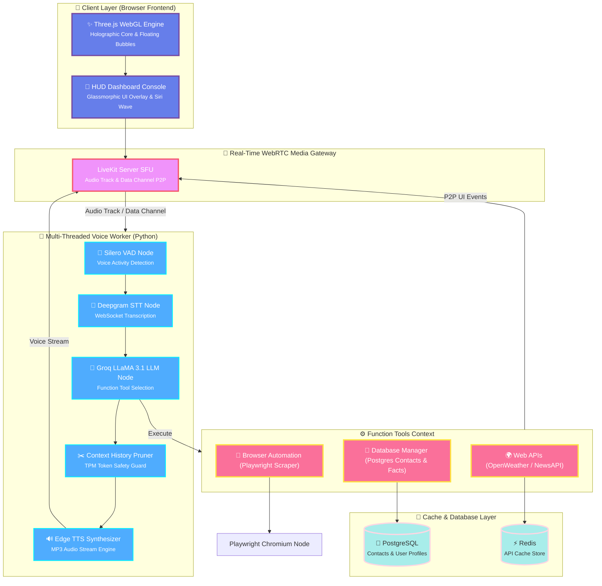

<div align="center">

# 🎙️ Multi-Threaded WebRTC Voice Agent & 3D HUD Dashboard


An **industry-grade Multi-Threaded WebRTC Voice Assistant** featuring an interactive 3D WebGL HUD dashboard. XYRA achieves sub-100ms conversational response loops by coupling a stateful LiveKit worker pipeline, Silero VAD, and Deepgram STT with a local geocoding cache backend (PostgreSQL + Redis) and automated visual page auditing via Playwright.

[Features](#-features) • [Architecture](#-architecture) • [Tech Stack](#-tech-stack) • [Getting Started](#-getting-started) • [API & Event Schema](#-api--event-schema)

</div>

---

<h2 align="center">🎯 Features</h2>

<div align="center">
<table width="100%">
<tr>
<td width="50%" align="center">

### ⚡ Sub-100ms Conversational Latency
* **WebSocket Streaming STT** - Direct microphone-to-transcription translation powered by Deepgram WebSocket pipeline.
* **Warm Natural Identity** - Friendly non-robotic verbal styles configured with Edge TTS voice outputs (`en-IN-NeerjaNeural`).
* **Adaptive Interruption Detector** - Silero VAD monitors incoming frames, immediately cutting off agent audio queues when user speech starts.

</td>
<td width="50%" align="center">

### 🔒 Secure Hybrid Data Layer
* **Persistent Profiling** - Stores core user characteristics, contacts, and relationship maps in PostgreSQL schemas.
* **2ms Cache Retrieval** - External OpenWeather and NewsAPI responses are structured and cached in Redis with a custom TTL.
* **Fuzzy Database Finder** - Translates verbal descriptions (*"my father"*, *"last name"*) to database targets using fuzzy ILIKE lookups.

</td>
</tr>
<tr>
<td width="50%" align="center">

### 🔄 Multi-Threaded UI Emitter
* **WebRTC Data Channel Sync** - Telemetry JSON updates are sent peer-to-peer, bypassing standard HTTP routing completely.
* **Glassmorphic Hud Widgets** - Translucent sidebar cards slide into place on weather or news queries with automatic 30s self-destruction timers.
* **Interactive 3D Visualizer** - Audio-responsive Three.js central energy core shifts scale and color gradients in real-time sync with vocal volumes.

</td>
<td width="50%" align="center">

### 🤖 Web Automation Integration
* **Playwright Scraper Agent** - Opens a headless browser in the background, extracting and summarizing page data with strict 8-second page timeouts.
* **Chrome visible automation** - Verbally triggers local system processes to pop open visible browser searches.
* **Hardware system hooks** - Direct voice instructions to activate physical devices like webcam feeds.

</td>
</tr>
</table>
</div>

---

## 🏗️ Architecture



---

<h2 align="center">🛠️ Tech Stack</h2>

<table align="center">
<tr>
<td align="center" width="20%">
<br>
<b>Three.js</b><br>
<sub>WebGL Graphics</sub>
</td>
<td align="center" width="20%">
<br>
<b>LiveKit</b><br>
<sub>WebRTC Voice SDK</sub>
</td>
<td align="center" width="20%">
<br>
<b>Groq Cloud</b><br>
<sub>LLaMA 3.1 Inference</sub>
</td>
<td align="center" width="20%">
<br>
<b>PostgreSQL</b><br>
<sub>Relational Profiles</sub>
</td>
<td align="center" width="20%">
<br>
<b>Redis</b><br>
<sub>Asynchronous Caching</sub>
</td>
</tr>
<tr>
<td align="center" width="20%">
<br>
<b>Playwright</b><br>
<sub>Browser Automation</sub>
</td>
<td align="center" width="20%">
<br>
<b>Python 3.11</b><br>
<sub>Voice Worker Core</sub>
</td>
<td align="center" width="20%">
<br>
<b>HTML5 & CSS3</b><br>
<sub>Obsidian Glass HUD</sub>
</td>
<td align="center" width="20%">
<br>
<b>SQLAlchemy</b><br>
<sub>Asyncpg Pooling</sub>
</td>
<td align="center" width="20%">
<br>
<b>Deepgram</b><br>
<sub>Streaming Speech-to-Text</sub>
</td>
</tr>
</table>

---

<h3 align="center">📊 Technology Breakdown</h3>

<div align="center">

| Category | Technologies |
| :---: | :---: |
| **🎨 Frontend HUD** | HTML5, Canvas API, CSS3 Glassmorphism (Frosted glass backdrop-filters) |
| **✨ 3D Engine** | Three.js WebGL (Audio-reactive energy cores, drifting particle satellites) |
| **📡 Media Server** | LiveKit SFU (Secure WebSockets, WebRTC P2P media loops) |
| **🧠 Inference Core** | Groq API `llama-3.1-8b-instant` (6,000 TPM limit-managed context pruner) |
| **💾 Relational DB** | PostgreSQL 16, Asyncpg connection pooling (`min_size=1`, `max_size=10`) |
| **⚡ Cache Engine** | Redis 7 (Async ping verification, custom cache TTL serializations) |
| **🤖 Scraper Engine** | Playwright Chromium (8-second page timeout timeouts, domcontentloaded fallbacks) |

</div>

---

## 📁 Project Structure

```
Multi-threaded-WebRTC-Voice-Agent--Xyra/
│
├── ⚙️ xyra/
│   ├── 🛠️ tools/              # Custom agent function tools context
│   │   ├── browser.py         # Playwright Chromium scraper & automation
│   │   ├── database.py        # Contacts and profiles database connectors
│   │   └── web.py             # Capped Weather and News API fetches
│   ├── ⚡ agent.py             # LiveKit entrypoint worker & context pruner
│   ├── 💾 db.py                # Database connection manager (PG/Redis)
│   └── 💻 db_init.py           # SQL schemas generator and seed data
│
├── 🎨 frontend/
│   ├── index.html             # Futuristic obsidian console dashboard
│   ├── style.css              # Glowing HUD and Wave CSS layout params
│   └── app.js                 # WebGL renderer, wave generator & audio sync
│
├── 🐳 docker-compose.yml       # DB containers (PostgreSQL & Redis)
├── 📦 pyproject.toml           # Poetry / uv module definitions
└── 🔒 .env                     # Project API Keys
```

---

<h2 align="center">🚀 Getting Started</h2>

### Prerequisites

```bash
# Required Platforms
Python 3.11+
Docker Desktop
```

### 1️⃣ Environment Configuration

Create a `.env` file in the root directory:

```env
# 📡 LiveKit Media Server
LIVEKIT_API_KEY=your_livekit_api_key_here
LIVEKIT_API_SECRET=your_livekit_api_secret_here
LIVEKIT_URL=wss://your-livekit-project-url.livekit.cloud

# 🤖 Groq LLM Key & Deepgram STT
GROQ_API_KEY=your_groq_api_key_here
DEEPGRAM_API_KEY=your_deepgram_api_key_here

# 🔌 APIs Telemetry
OPENWEATHER_API_KEY=your_openweather_key
NEWS_API_KEY=your_news_key

# 💾 Databases Connection
DB_HOST=localhost
DB_PORT=5432
DB_USER=postgres
DB_PASSWORD=your_postgres_password
DB_NAME=xyra_db

REDIS_HOST=localhost
REDIS_PORT=6379
```

### 2️⃣ Database Setup

Start your persistent PostgreSQL and Redis containers:
```bash
docker-compose up -d
```

### 3️⃣ Install Dependencies

We use `uv` for ultra-fast dependency synchronization:
```bash
# Sync packages and install project virtual environment
uv sync
```

### 4️⃣ Database Schema Initialization

Run the DB initializer script to set up PostgreSQL schemas and seed profiles and contacts:
```bash
.venv\Scripts\python -m xyra.db_init
```

### 5️⃣ Launch Voice Worker & Dashboard

Start the LiveKit dev worker agent in a terminal:
```bash
run_agent.bat
```

Open a second terminal and start the local HTTP dashboard server:
```bash
run_dashboard.bat
```
Navigate to `http://localhost:8000` in Chrome to open the HUD interface, verify the connection status badge transitions to **Live**, and start the conversation!

---

<h2 align="center">📝 License</h2>

<div align="center">

This project is available for educational and commercial use.

</div>

---

<div align="center">
 Built with ❤️ using LiveKit, WebGL, and LLaMA 3.1
⭐ Star this repo if you find it helpful!

</div>
